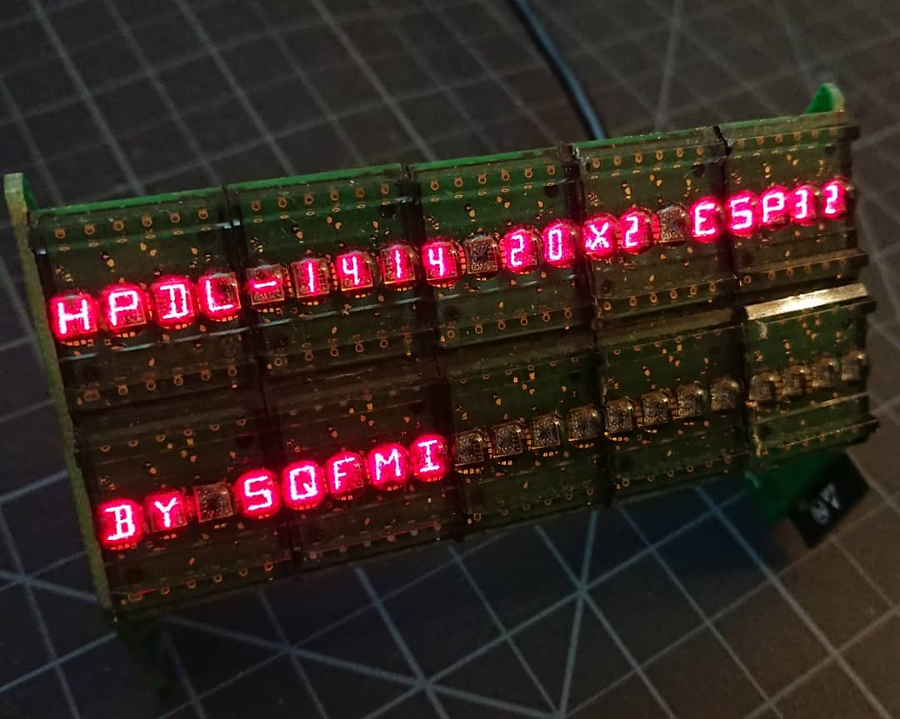
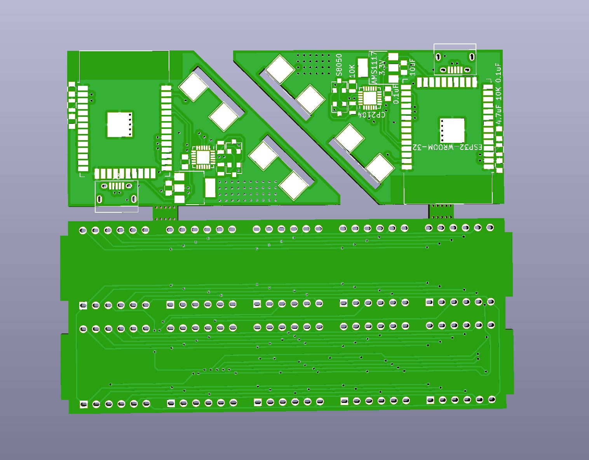

# HPDL-1414-20x2-ESP32
- 20x2 Character Display with HPDL1414 modules &amp; ESP32
- PCB Structure

## Bill of Materials
| Component           | Quantity | Link                                             |
|---------------------|----------|--------------------------------------------------|
| HPDL1414            | 10       | https://www.aliexpress.com/item/32604004029.html |
| ESP32-WROOM-32D     | 1        |                                                  |
| CP2104              | 1        |                                                  |
| AMS1117-3.3V        | 1        |                                                  |
| 74HC595 SOIC-16     | 3        |                                                  |
| 0.1uF 0805          | 15       |                                                  |
| 4.7uF 0805          | 1        |                                                  |
| 10uF 0805           | 1        |                                                  |
| Micro USB Connector | 1        |                                                  |
| S8050 SOT-23        | 2        |                                                  |
| 10K 0805            | 4        |                                                  |
